# Everpast

## Preserve your memories

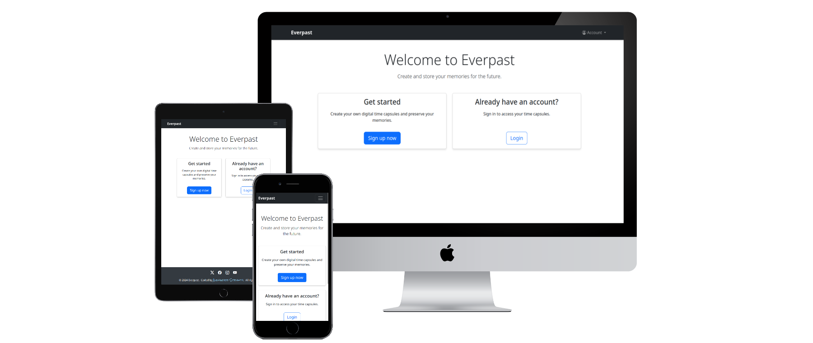

(Developer: Alexander Strauch)

## **[Live site](https://everpast-3fdc47cf65e4.herokuapp.com/)**

## Table of contents

1. [Introduction](#introduction)
   - [Project description](#project-description)
   - [Purpose](#purpose)
2. [UX](#ux)
   - [User demographic](#user-demographic)
   - [User goals](#user-goals)
   - [User expectations](#user-expectations)
   - [User stories](#user-stories)
3. [Design](#design)
    - [Colors](#colors)
    - [Fonts](#fonts)
4. [Features](#features)
    - [Existing features](#existing-features)
    - [Future features](#future-features)
5. [Languages](#languages)
6. [Database schema](#database-schema)
    - [ERD](#erd)
    - [Database models description](#database-models-description)
7. [Technologies](#technologies)
8. [Agile tools](#agile-tools)
9. [Libraries](#libraries)
10. [Testing](#testing)
   - [Test results](#test-results)
   - [HTML validation](#html-validation)
   - [CSS validation](#css-validation)
   - [JavaScript validation](#javascript-validation)
   - [Python validation](#python-validation)
11. [Bugs](#bugs)
12. [Deployment](#deployment)
13. [Forking](#forking)
14. [Credits](#credits)
15. [Acknowledgements](#acknowledgements)

## Introduction

### Project description

- Everpast is a Django-based web application that enables users to create digital time capsules by uploading images, videos, and documents, which can be locked until a specified future date. The project aims to bridge the gap between past and future by providing a secure, digital way to preserve memories and messages for future access.

### Purpose

- Memory preservation: Users can securely store personal memories, photos, videos and documents in digital time capsules.

- Future communication: Enable users to send messages, letters or media to their future selves or loved ones, accessible only after a predetermined date.

- Legacy creation: Provide a platform for users to create meaningful digital legacies that can be shared with future generations.

- Emotional connection: Bridge temporal gaps by allowing people to connect with their past selves and share meaningful moments across time.

[Back to table of contents](#table-of-contents)

## UX

### User demographic

- Primary users: Individuals aged 18-45 who are comfortable with digital technology

- Secondary users: Families wanting to preserve memories

- Tertiary users: Organizations looking to document their history

### User goals

- Create and manage digital time capsules

- Securely store various types of content

- Set future dates for capsule unlocking

- Receive notifications when capsules unlock

- Share memories with future recipients

### User expectations

- Clean modern visual appearance which follows best practices

- Privacy and security: Assurance that their personal memories and messages are stored securely and will only be accessible at the intended time

- Reliability and longevity: Confidence that the platform will remain operational and accessible for the intended duration, possibly spanning years or decades

- Ease of use: A user-friendly interface for creating, managing, and accessing their time capsules without technical difficulties

- Media compatibility: Support for a wide range of content types, such as text, images, audio, and video files

- Notification systems: Timely reminders or updates related to the time capsule’s status and release dates

- Cross-platform accessibility: Access across multiple devices and platforms, ensuring seamless usability

### User stories

#### User

- As a new user, I want to create an account so that I can start creating time capsules

- As a registered user, I want to manage my profile so that I can update my information

- As a user, I want a robust email verification system so that my account is secure

- As a user, I want a secure password reset system so that I can recover my account

- As a user, I want clear feedback on my actions so I know what's happening

- As a user, I want to create a new time capsule so that I can store my memories

- As a user, I want to view all my time capsules so that I can manage them

- As a user, I want to upload different types of content so that I can preserve various memories

- As a user, I want my capsules to be secure so that only I can access them

- As a user, I want an intuitive and responsive interface that works well on all devices

#### Site owner

- As a site owner, I want to monitor user activity so that I can ensure appropriate platform usage

- As a site owner, I want to manage user accounts so that I can maintain platform security

- As a site owner, I want to manage storage resources so that I can optimize platform performance

- As a site owner, I want to maintain platform security so that user data remains protected

- As a site owner, I want to monitor platform performance so that I can ensure reliable service for all users

- As a site owner, I want to implement content moderation tools to ensure that uploaded content adheres to community guidelines and legal standards

[Back to table of contents](#table-of-contents)

## Design

### Colors

<details>
<summary>Used for Sign up now button, save changes button, view capsule button and add content button (click me)</summary>
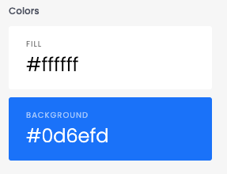
</details>

<details>
<summary>Used for the login & edit capsule button (click me)</summary>
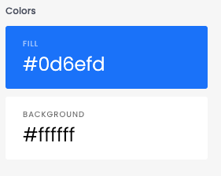
</details>

<details>
<summary>Used for the logo (click me)</summary>
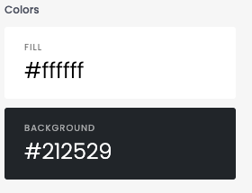
</details>

<details>
<summary>Used for the account navigation (click me)</summary>
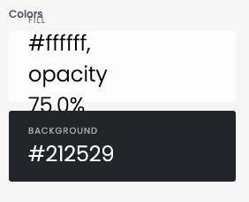
</details>

<details>
<summary>Used for the majority of the viewport (click me)</summary>
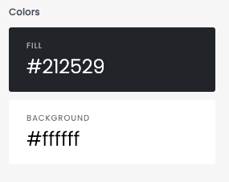
</details>

<details>
<summary>Used for the social icons (click me)</summary>
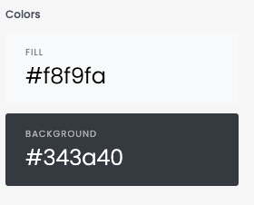
</details>

<details>
<summary>Used for the GitHub link (click me)</summary>
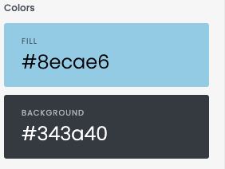
</details>

<details>
<summary>Used for the hover effect on the GitHub link (click me)</summary>
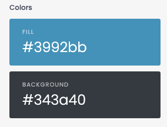
</details>

<details>
<summary>Used for the lock capsule button(click me)</summary>
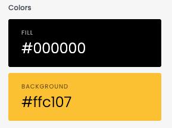
</details>

<details>
<summary>Used for the capsule locked status (click me)</summary>
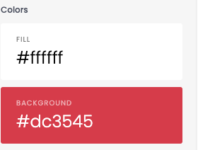
</details>

<details>
<summary>Used for the capsule unlocked status (click me)</summary>
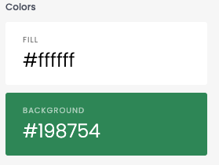
</details>

<details>
<summary>Used for the deletion of capsules (click me)</summary>
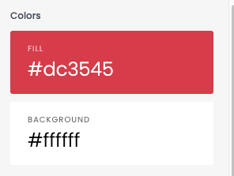
</details>

<details>
<summary>Used for the cancellation of edit button (click me)</summary>
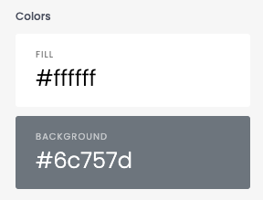
</details>

### Fonts

- **Rock Salt**
    - Used for: Special text element and branding
    - Source: Google Fonts
    - Link: [Google Fonts - Rock Salt](https://fonts.google.com/specimen/Rock+Salt)
    - Purpose: Adds a handwritten, personal touch to special elements

- **System Font Stack** (via Bootstrap)
    - Used for: General content and UI elements
    - Includes: -apple-system, BlinkMacSystemFont, Segoe UI, Roboto, Helvetica Neue, Arial
    - Purpose: Ensures optimal readability and native feel across different operating systems

[Back to table of contents](#table-of-contents)

## Features

### Existing Features

- User authentication and authorization
  - Secure user registration and login
  - Personal dashboard for managing time capsules
  - Role-based access control

- Time capsule creation
  - Upload multiple types of content (images, videos, documents)
  - Set future "unlock" dates
  - Support for multiple file formats

- Time capsule management
  - View all created capsules
  - Edit capsule details before locking
  - Countdown timer for locked capsules

- Responsive design
  - Mobile-first approach
  - Bootstrap-based UI
  - Accessible interface
  - Intuitive user experience

### Future features

- Social login integration

- Advanced capsule filtering

- Content organization tools

- Sharing settings

- Premium subscriptions

- Real-time collaboration

- Mobile applications

[Back to table of contents](#table-of-contents)

## Languages

- Python 3.11

- HTML5

- CSS3

- JavaScript

[Back to table of contents](#table-of-contents)

## Database schema

### ERD

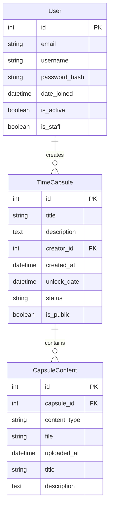

### Database models description

#### User
- Primary model for authentication and user management
- Stores essential user information and account status
- Links to all user-created content and interactions

#### TimeCapsule
- Core model for storing time capsule information
- Manages capsule state and access control
- Links to creator and all associated content

#### CapsuleContent
- Stores individual pieces of content within capsules
- Handles different content types (images, videos, documents)
- Manages metadata and file storage

[Back to table of contents](#table-of-contents)


## Technologies

- GitHub for the repository

- Gitpod (IDE)

- git for version control

- Chrome Dev Tools

- Balsamiq for the wireframes

- Google Fonts for the _Rock Salt_ font

- System font stack via Bootstrap: system-ui, -apple-system, "Segoe UI", Roboto, "Helvetica Neue", "Noto Sans", "Liberation Sans", Arial, sans-serif, "Apple Color Emoji", "Segoe UI Emoji", "Segoe UI Symbol", "Noto Color Emoji"

- Adobe color

- W3C for HTML code validation

- W3C for CSS code validation

- JShint for JavaScript validation

- CI Python linter for Python validation

- Bootstrap icons

- PostgreSQL for the database

- SendGrid for emails

[Back to table of contents](#table-of-contents)

## Libraries

- Django 4.2

- Bootstrap 5

- jQuery

- Crispy Forms

- Django Allauth

- Cloudinary

- WhiteNoise

- Gunicorn

[Back to table of contents](#table-of-contents)

## Testing

#### Authentication testing
- ✅ User registration with email verification
- ✅ Login with credentials
- ✅ Password reset functionality
- ✅ Social authentication

#### Time capsule testing
- ✅ Capsule creation with various content types
- ✅ Future date setting
- ✅ Content upload and storage
- ✅ Capsule locking mechanism
- ✅ Notification system

#### Responsive design testing
- ✅ Mobile devices (iOS/Android)
- ✅ Tablets
- ✅ Desktop browsers (Chrome, Safari, Firefox)
- ✅ Different screen sizes


### HTML validation

<details>
<summary>W3C for HTML code validation (click me)</summary>

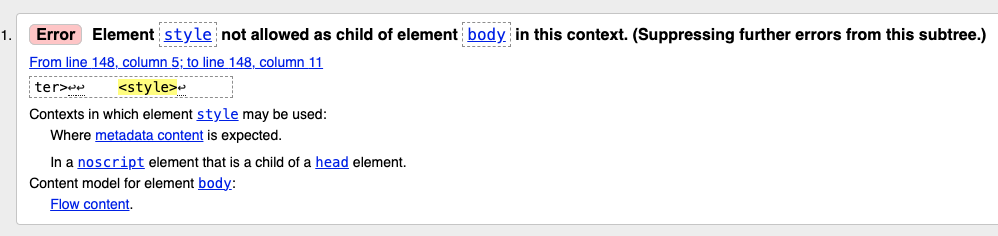
</details>

### CSS validation

<details>
<summary>W3C for CSS code validation (click me)</summary>

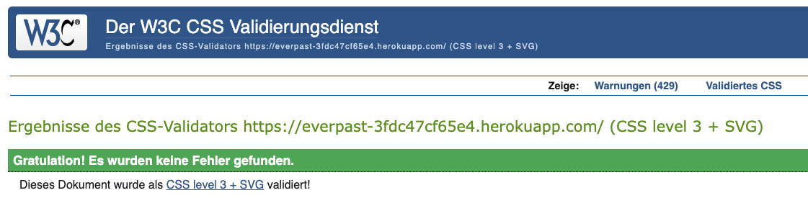
</details>

### JavaScript validation

<details>
<summary>JShint for JavaScript validation (click me)</summary>

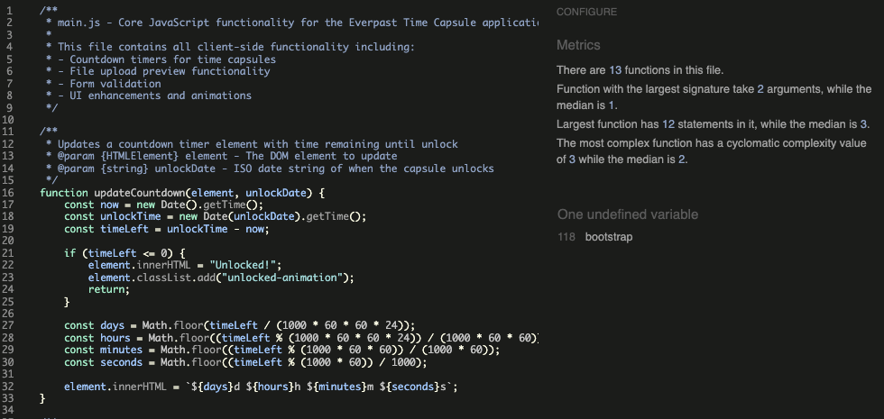
</details>

### Python validation

<details>
<summary>Validation with CI Python Linter (click me)</summary>

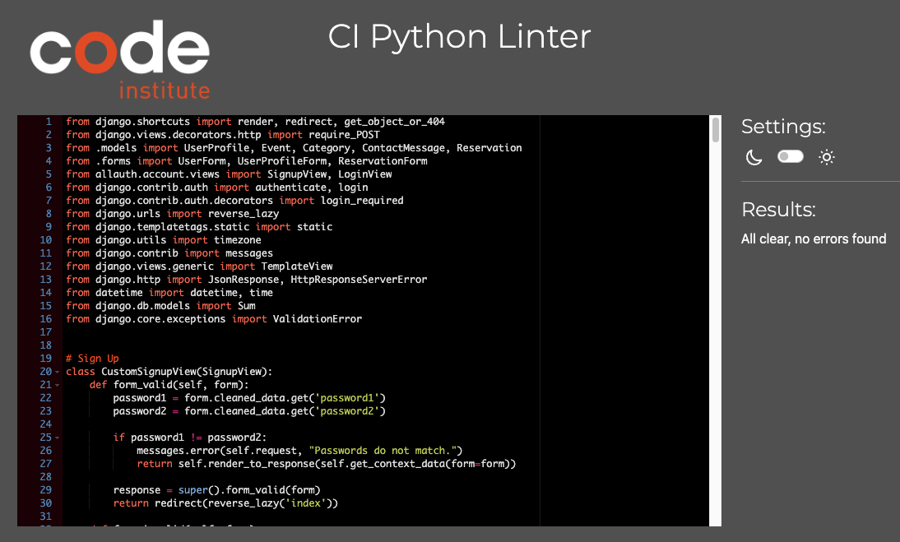
</details>

[Back to table of contents](#table-of-contents)

## Bugs

| Bug                                                                                |Fix                                         |
| -----------------------------------------------------------------------------------|--------------------------------------------|
| When logging out of the admin dashboard I received an internal server error.       | 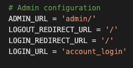        |
| Horizontal scrollbar at the bottom when I click on the "Sign up" button            | 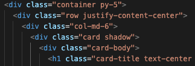        |
| When viewed on a mobile viewport in DevTools, the "Welcome to Everpast" and "Create and store your memories for the future" get pushed to the top, the welcome message is not readable anymore respectively disappears.     | 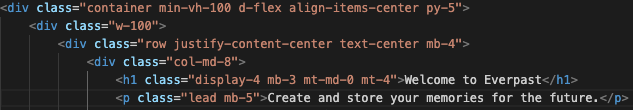        |
| Footer gets pushed down now when viewed on tablet or larger screens.      | 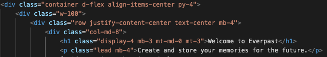        |
| When I view the homepage on a mobile viewport the 2 cards containing the "Get started" and "Already have an account?" get stacked on top of each other without any margin between them. Also when I view the homepage on a tablet or larger screen size the 2 cards have different sizes.      | 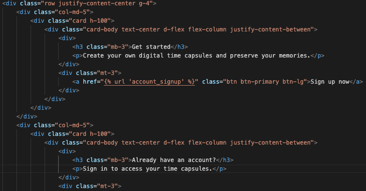        |
| When I want to login into my admin dashboard I get an internal server error.     | 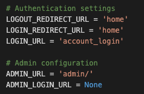        |
| When I want to log out of my admin dashboard I get an internal server error.      | 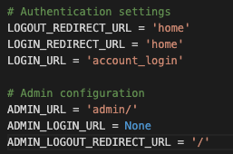 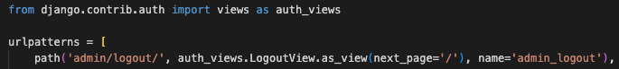       |
| I get an internal server error when I provide an email address and password and click on the "Sign up" button on the deployed app. | 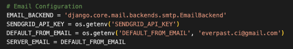        |
| I get an internal server error when I provide an email address and password and click on the "Sign up" button on the deployed app.      | 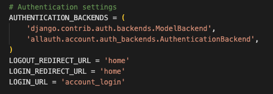        |

[Back to table of contents](#table-of-contents)

## Deployment

I deployed this Django application on Heroku, taking advantage of its integration with GitHub. Here's a step-by-step overview of my deployment process:

1. **Heroku app creation**:
   I accessed my Heroku dashboard, navigated to “New,” and selected “Create new app.” Then, I picked a unique name for the app and chose the correct region.

2. **GitHub integration**:
   On the app’s “Deploy” tab, I chose GitHub as the deployment method. I linked my GitHub account and selected the repository with my Django app.

3. **Environment configuration**:
   In the "Settings" tab, I clicked on "Reveal Config Vars" and added the necessary environment variables:

- `CLOUDINARY_API_KEY`: My Cloudinary API key
- `CLOUDINARY_API_SECRET`: My Cloudinary API secret
- `CLOUDINARY_CLOUD_NAME`: My Cloudinary cloud name
- `DATABASE_URL`: The URL provided by Code Institute for the database
- `DEBUG`: set to False
- `DEFAULT_FROM_EMAIL`: My default email address used with SendGrid
- `EMAIL_BACKEND`: My email backend service
- `SECRET_KEY`: My Django secret key
- `SENDGRID_API_KEY`: My SendGrid API key

4. **Database configuration**:
   Since my database is supplied by Code Institute, I verified that the `DATABASE_URL` in Config Vars was correctly configured with the provided database URL. In my Django settings, I ensured this environment variable was used to set up the database connection.

5. **Buildpack configuration**:
   In the “Settings” tab, I navigated to the “Buildpacks” section, clicked “Add buildpack,” and chose “heroku/python.”

6. **Deployment configuration**:
   On the “Deploy” tab, under “Deployment method,” I verified that GitHub was chosen. In the “App connected to GitHub” section, I made sure my repository was linked.

7. **Manual deploy**:
   I scrolled down to the “Manual deploy” section, selected the main branch, and clicked “Deploy Branch.”

8. **Verify deployment**:
   After the deployment was complete, I clicked “View” to open the app and confirm it was functioning properly.

[Back to table of contents](#table-of-contents)

## Forking

If you'd like to fork this repository and run it locally, follow these steps:

1. **Fork the repository**:
   - Navigate to the GitHub repository: [Everpast](https://github.com/alexstrauch/everpast)
   - In the top-right corner of the page, click the "Fork" button.
   - This will create a copy of the repository in your GitHub account.

2. **Clone your fork**:
   - On your forked repository page, click the "Code" button and copy the URL.
   - Open your terminal and run:
     ```
     git clone [URL you just copied]
     ```
   - This creates a local copy of the repository on your machine.

3. **Set up virtual environment**:
   - Navigate into the project directory:
     ```
     cd [project directory name]
     ```
   - Create a virtual environment:
     ```
     python -m venv venv
     ```
   - Activate the virtual environment:
     - On Windows: `venv\Scripts\activate`
     - On macOS and Linux: `source venv/bin/activate`

4. **Install dependencies**:
   - With your virtual environment activated, install the required packages:
     ```
     pip install -r requirements.txt
     ```

5. **Set up environment variables**:
   - Create a `env.py` file in the root directory of the project.
   - Add the following variables (replace with your actual values):
     ```
     SECRET_KEY=your_secret_key
     DATABASE_URL=your_database_url
     CLOUDINARY_API_KEY=your_cloudinary_api_key
     CLOUDINARY_API_SECRET=your_cloudinary_api_secret
     CLOUDINARY_CLOUD_NAME=your_cloudinary_cloud_name
     DEFAULT_FROM_EMAIL=your_email_address
     EMAIL_BACKEND=your_email_backend_service
     SENDGRID_API_KEY=your_sendgrid_api_key
     DEBUG=True
     ```

    
    Important notes: 
    - Make sure to set `DEBUG=True` for local development and testing in `env.py`.
    - Remember to never commit the `env.py` file or any sensitive information to version control. If you plan to deploy your fork, make sure to set up the necessary environment variables in your deployment environment.

6. **Apply Migrations**:
   - Run the following commands to apply database migrations:
     ```
     python manage.py makemigrations
     python manage.py migrate
     ```

7. **Run the development server**:
   - Start the Django development server:
     ```
     python manage.py runserver
     ```
   - Open a web browser and navigate to `http://127.0.0.1:8000/` to view the application.


[Back to table of contents](#table-of-contents)

## Credits

- [Django 4.2](https://www.djangoproject.com/)

    - Source: Django Software Foundation (DSF)
	- Description: Django is a high-level Python web framework that encourages rapid development and clean, pragmatic design.
	- Acknowledgment: “Django 4.2, developed by the Django Software Foundation, provided the core framework for building and managing my web application.”

- [Bootstrap 5](https://getbootstrap.com/)

    - Source: Bootstrap
	- Description: A popular front-end CSS framework that simplifies responsive and mobile-first web design.
	- Acknowledgment: “Bootstrap 5, maintained by the Bootstrap community, enabled the creation of a responsive and visually appealing user interface for my project.”

- the almighty Google


[Back to table of contents](#table-of-contents)

## Acknowledgements

I would like to thank my mentor Gareth McGirr for his useful tips and keen insight.

[Back to table of contents](#table-of-contents)